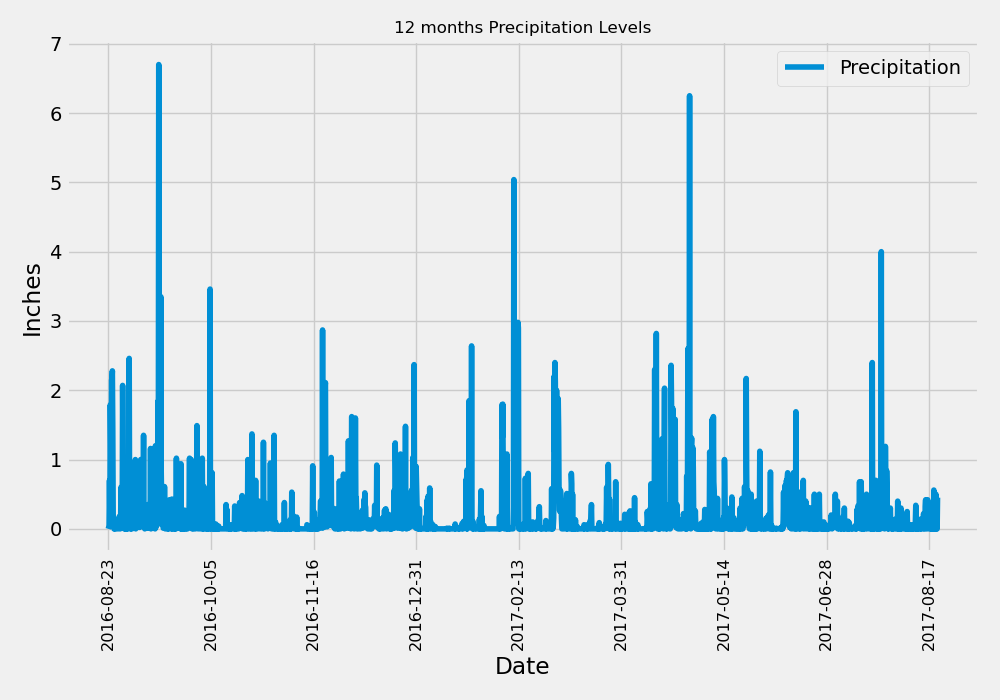

# sqlalchemy-challenge

### Scenario

You have a SQLite database which contains data collected from Hawaii weather stations. Using the Object Relational Mapper (ORM) SQLAlchemy, connect to the SQLite database and complete two tasks:

- Complete a brief Climate Analysis
- Design a Climate App using Flask, to deliver static API pages and two Dynamic API pages

------

### Climate Analysis

The analysis is broken into two sections:

| Analysis | Description |
|----------|-------------|
|Precipitation Analysis | Obtain the past twelve months data, calculated from the most recent data entry date. With this data create a plot of the level of precipitation recorded across the twelve months.|
|Station Analysis | Calculate the number of stations recording data. From this retrieve the amount of recordings taken per station and plot the most active's 'tobs' on a histogram. |

#### Precipitation Analysis

Required steps:

- Find the most recent date in the dataset.
- Using that date, get the previous 12 months of precipitation data by querying the previous 12 months of data.
- Select only the "date" and "prcp" values.
- Load the query results into a Pandas DataFrame. Explicitly set the column names.
- Sort the DataFrame values by "date".
- Plot the results by using the DataFrame plot method
- Use Pandas to print the summary statistics for the precipitation data.  

| Plot output: |
|--------------|
|  |  

-------

#### Station Analysis

Required steps:

- Design a query to calculate the total number of stations in the dataset.
- Design a query to find the most-active stations (that is, the stations that have the most rows). To do so, complete the following steps:
    - List the stations and observation counts in descending order.
    - Answer the following question: which station id has the greatest number of observations?
- Design a query that calculates the lowest, highest, and average temperatures that filters on the most-active station id found in the previous query.
- Design a query to get the previous 12 months of temperature observation (TOBS) data. To do so, complete the following steps:
    - Filter by the station that has the greatest number of observations.
    - Query the previous 12 months of TOBS data for that station.
    - Plot the results as a histogram with bins=12
- Close your session.

| Plot output: |
|--------------|
|  |

--------

### Climate App

Using the Flask module, design an API based on the queries developed. 
Create the following routes:

##### Static Routes
- /
    - Start at the homepage.
    - List all the available routes.
- /api/v1.0/precipitation
    - Convert the query results from your precipitation analysis (i.e. retrieve only the last 12 months of data) to a dictionary using date as the key and prcp as the value.
    - Return the JSON representation of your dictionary.
- /api/v1.0/stations
    - Return a JSON list of stations from the dataset.
- /api/v1.0/tobs
    - Query the dates and temperature observations of the most-active station for the previous year of data.
    - Return a JSON list of temperature observations for the previous year. 

##### Dynamic Routes
- /api/v1.0/[start]
    - Return a JSON list of the minimum temperature, the average temperature, and the maximum temperature for a specified start range.
    - For a specified start, calculate TMIN, TAVG, and TMAX for all the dates greater than or equal to the start date.
- /api/v1.0/[start]/[end]
    - Return a JSON list of the minimum temperature, the average temperature, and the maximum temperature for a specified start-end range.
    - For a specified start date and end date, calculate TMIN, TAVG, and TMAX for the dates from the start date to the end date, inclusive.  

My developed code for the Flask API can be found here: [Flask API App](SurfsUp/app.py)

--------

## References

| Reference Name | Description |
|----------------|-------------|
| Menne, M.J., I. Durre, R.S. Vose, B.E. Gleason, and T.G. Houston | 2012: An overview of the Global Historical Climatology Network-Daily Database. |
| Journal of Atmospheric and Oceanic Technology, 29, 897-910, | [https://journals.ametsoc.org/view/journals/atot/29/7/jtech-d-11-00103_1.xml](https://journals.ametsoc.org/view/journals/atot/29/7/jtech-d-11-00103_1.xml) |
| edX Boot Camps LLC | Putting the challenge assignment together and supplying required materials/starter code |
| AskPython.com | Confirmation on how to utilize the "\__contains__()" function within my Flask API [Link Here](https://www.askpython.com/python/string/python-string-contains) |
| Python DateTime Docs | Documentation on the functions and usage of the "datetime" module within Python [Link Here](https://docs.python.org/3/library/datetime.html#strftime-and-strptime-behavior) |
| Flask Documentation | Additional research and tutorials on usage of the Flask Module [Link Here](https://flask.palletsprojects.com/en/3.0.x/) |
|||